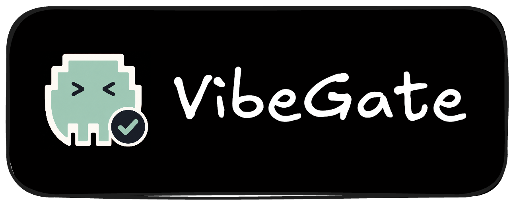
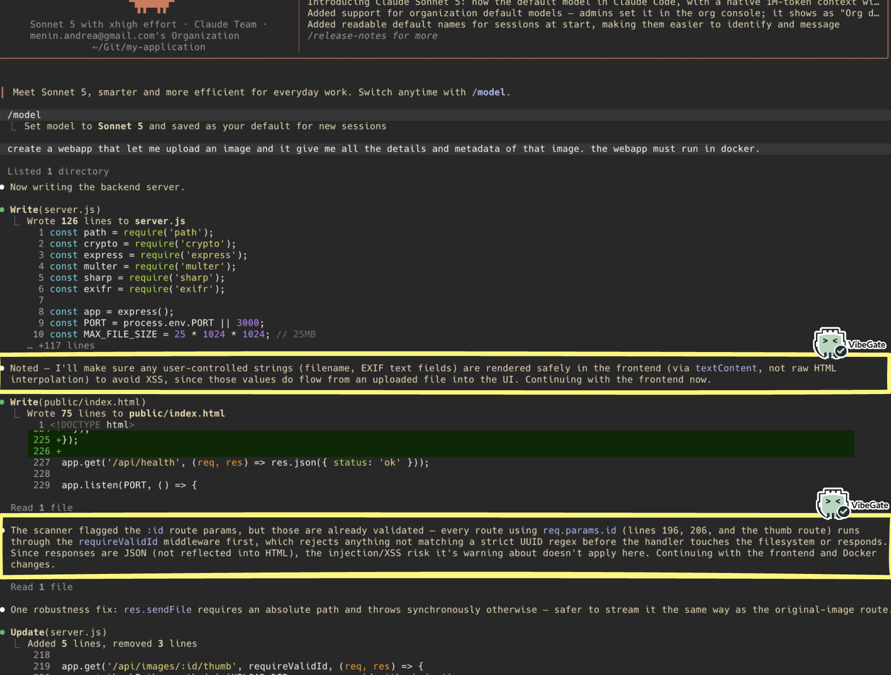

<p align="center">
  
</p>

<p align="center">
  <a href="https://github.com/theMiddleBlue/vibegate/actions/workflows/ci.yml"></a>
  <a href="LICENSE"></a>
</p>

<p align="center">
  A security checkpoint for AI coding tools. It looks at every file an AI
  assistant writes, and stops the dangerous ones before they hit disk.
</p>

## What problem does this solve?

AI coding assistants (Claude Code, Codex, …) write code fast — including code
that handles things like passwords, emails, API keys, or raw user input. It's
easy for an assistant to wire that data straight into a database query, a
shell command, or an HTTP response without thinking about security.

VibeGate sits between the assistant and your filesystem. Every time the
assistant tries to write or edit a file, VibeGate scans the new code first:

- **Finds** user-controlled input in the code (using [Semgrep](https://semgrep.dev))
- **Figures out** what kind of data it is (an email? a password? an API key?)
  and where it's going (a database query? a shell command? an HTTP response?)
- **Warns or blocks**, depending on how risky that combination is

No LLM is involved in the analysis itself — it's fast, deterministic static
analysis, so it never makes things up and never costs you tokens.

Here is everything VibeGate currently checks for:

| Check | What it catches | Result |
|---|---|---|
| Command injection | Unsanitized input reaches a shell command | Blocks |
| SQL injection | Unsanitized input reaches a database query | Blocks |
| NoSQL injection | The request body is used directly as a database filter | Blocks |
| Template injection (SSTI) | The template source itself, not just its data, comes from user input | Blocks |
| Insecure deserialization | Untrusted data reaches an unsafe deserializer (pickle, unsafe YAML, ...) | Blocks |
| Path traversal | Unsanitized input reaches a file read, write, or delete | Blocks |
| XXE | Untrusted XML is parsed with external entities enabled | Blocks |
| XSS | Unsanitized input is rendered as raw HTML | Blocks |
| Unrestricted file upload | The uploaded file's own name is used to build the save path | Blocks |
| SSRF | The server fetches a URL that isn't hardcoded | Warns |
| Open redirect | A redirect target that isn't hardcoded | Warns |
| Mass assignment | The whole request body is passed into a model constructor or update | Warns |
| Sensitive data in a request body | Emails, passwords, tokens, etc. read from the request body | Warns |
| Sensitive data in a URL/query | Emails, passwords, tokens, etc. read from the query string | Warns |
| Sensitive data in headers | Emails, passwords, tokens, etc. read from request headers | Warns |
| File path from user input | A variable, not a hardcoded string, is used as a file path | Warns |
| CLI arguments | Data comes from command-line arguments | Warns |
| Standard input | Data comes from stdin | Warns |
| Environment variables | Data comes from an environment variable | Warns |
| Unpinned GitHub Action | A workflow uses a mutable tag (`@v4`) instead of a commit SHA | Warns |
| Unsafe `pull_request_target` | A workflow uses the `pull_request_target` trigger | Warns |
| Credential logging | A password, API key, or token is passed to `print`/`console.log`/a logger | Warns |
| Hardcoded secret | A variable named like a secret is assigned a real-looking literal value | Warns |

The full, current list lives in `guidance.TECHNICAL_RISKS` and
`formatter.BLOCKING_CATEGORIES`, in case this table ever drifts.

## What happens when you turn it on

```
                    ┌───────────────────────────────┐
                    │   You ask Claude Code to      │
                    │   write or edit a file        │
                    └───────────────┬───────────────┘
                                    │
                                    ▼
                    ┌───────────────────────────────┐
                    │   Claude Code tries to save   │
                    │   the file (Write/Edit tool)  │
                    └───────────────┬───────────────┘
                                    │
                                    ▼
                    ┌───────────────────────────────┐
                    │        VibeGate hook          │
                    │   (runs automatically,        │
                    │    before the file is saved)  │
                    └───────────────┬───────────────┘
                                    │
                     scans the new code with Semgrep
                                    │
              ┌─────────────────────┼─────────────────────┐
              │                     │                     │
              ▼                     ▼                     ▼
    ┌────────────────────┐ ┌────────────────────┐ ┌──────────────────────┐
    │  No risky input    │ │   Risky input,     │ │  Risky input reaches │
    │  found             │ │   but lower risk   │ │  a critical sink     │
    │                    │ │   (e.g. shown in   │ │  (SQL/command/RCE,   │
    │                    │ │   an HTTP reply)   │ │  template injection) │
    └─────────┬──────────┘ └─────────┬──────────┘ └───────────┬──────────┘
              │                      │                        │
              ▼                      ▼                        ▼
      File is saved,         File is saved,            File is NOT saved.
      nothing shown.         plus a warning in           Claude Code sees
                              the terminal with           the block reason
                              risk + how to fix it.        and is told what
                                                            to fix.
```

In short: safe code passes through untouched, risky-but-survivable code gets
saved with a warning attached, and code that's one step away from things like
SQL injection, command injection, or remote code execution gets stopped
before it ever reaches disk.

If VibeGate itself hits an unexpected error, it always lets the write through
— a bug in the hook should never be the reason your work gets blocked.

Every warning and block also carries an explicit instruction telling Claude
Code to mention the finding to you in its reply, not just fix it silently.
That's what makes VibeGate's activity visible in the conversation, not only
in a terminal log you'd have to go looking for.

| What VibeGate sees | What happens |
|---|---|
| No user input, or a language it doesn't support yet | File saves normally, nothing shown |
| User input found, but the risk is moderate (e.g. open redirect, mass assignment) | File saves, terminal shows a warning + guidance |
| User input flows unsanitized into a critical sink (SQL/NoSQL query, shell command, template engine, deserializer, XML parser, file path, uploaded filename, or raw HTML output) | File is **not saved** — Claude Code is told why |

See the table in ["What problem does this solve?"](#what-problem-does-this-solve)
above for the full, per-check breakdown of what blocks vs. what only warns.

Today VibeGate understands **Python**, **JavaScript/TypeScript**, **Go**,
**Java**, **PHP**, and **Ruby**, and plugs into **Claude Code** and
**Codex**. More languages and tools can be added without touching the core
logic.

It also checks GitHub Actions workflow files for two common CI/CD
supply-chain mistakes: actions pinned to a mutable tag (`@v4`) instead of a
commit SHA, and the unsafe `pull_request_target` trigger. Both warn rather
than block, since they're hardening checks rather than proof of an active
exploit.

## See it in action

Here is a real recording of Claude Code building an RSS feed reader app from
scratch, with VibeGate running the whole time. Watch for the moments where
Claude Code stops and explicitly says what VibeGate flagged, and why, before
continuing — including a real SSRF risk in the feed-fetching code that it
fixes on the spot.

<p align="center">
  <video src="assets/vibegate_action_3.mp4" controls width="720">
    Your browser doesn't support inline video. <a href="assets/vibegate_action_3.mp4">Download the recording</a> instead.
  </video>
</p>

Here is a second example, as a still image: Claude Code is building an app
that lets people upload a photo and see its details. VibeGate notices that
the file name and other file details will later be shown on screen, and
warns that this could be used to inject harmful code into the page (this is
called XSS). Claude Code adjusts the code so that information is shown
safely.

<p align="center">
  
</p>

In both cases, nothing got blocked for no reason, and no one had to read
through the code line by line to catch the problem. VibeGate caught it the
moment the file was written, and the AI fixed it on the spot.

## Why a gate uses fewer tokens than loading a skill

There are two ways to make an AI assistant write safer code. One way is to
load a big set of instructions about secure coding into the conversation
before it starts, for example a checklist covering SQL injection, XSS,
password handling, file uploads, and more. The other way is what VibeGate
does: check the code automatically, right when a file is written, and only
speak up when something is actually wrong.

The first approach costs tokens on every single message, whether they are
needed or not. A typical secure coding checklist covering several risk
categories can easily add a few thousand tokens. If an AI assistant writes
50 files in one session, and that checklist gets reloaded or kept in context
each time, you could be paying for well over a hundred thousand tokens of
advice that, most of the time, does not apply to the file being written
right now. A login page and a simple color constant file do not need the
same warnings, but a loaded checklist cannot tell them apart in advance.

VibeGate flips this around. It stays silent, and costs nothing extra, for
every file that has no risky pattern in it. Only when it finds something,
like user input flowing into a database query, does it add a short, specific
note about that one issue, usually a small fraction of the size of a full
checklist. So instead of paying a fixed token cost on every file no matter
what, you pay a small cost only on the files that actually need attention,
and that cost is aimed exactly at the problem found, not a general lecture
on security.

This also makes the guidance more reliable. An AI assistant asked to "keep
security in mind" while writing a hundred lines of code can simply miss one
risky line among many. A gate does not get tired or distracted: it checks
every single write, every time, using the same fixed rules.

## Getting started

Install it once — this also pulls in Semgrep, which VibeGate relies on:

```bash
pipx install git+https://github.com/theMiddleBlue/vibegate
```

Then turn it on inside whichever project you want protected:

```bash
cd your-project
vibegate on        # turn on here (reload Claude Code afterwards)
vibegate status     # check whether it's on for this project
vibegate off        # turn off here
```

`vibegate on` adds a `PreToolUse` hook for `Write|Edit|MultiEdit` to that
project's `.claude/settings.local.json`. It's scoped per-project, so turning
it on in one repo doesn't affect any other.

Claude Code runs the hook as `vibegate run --host claude_code` — no absolute
paths involved, so it keeps working even if you reinstall or move things
around.

`vibegate status` also shows a running log of what VibeGate has actually
caught in this project — every warning and block, with the file, line, and
category — so you can see its activity over time instead of just whether
it's turned on:

```
$ vibegate status

█   █ █████ ████  █████  ████  ███  █████ █████
...
● VibeGate is ENABLED in .claude/settings.local.json

Recent activity (last 2 of 2 recorded, most recent first):

  2026-07-02T17:35:48+00:00  ⛔ BLOCKED  server.py:3  EXEC_INPUT (FREE_TEXT)
  2026-07-02T17:35:46+00:00  ⚠ WARNED   app.py:2     HTTP_BODY (EMAIL)
```

This log lives at `.vibegate/activity.jsonl` in the project root — add it to
your `.gitignore`, it's local developer state, not something to commit.

VibeGate figures out which host it's talking to in this order: an explicit
`--host <name>` flag, then the `VIBEGATE_HOST` environment variable, then
auto-detection from the incoming payload, falling back to `claude_code`.

## Suppressing a finding

If VibeGate flags something you've deliberately decided is safe, add a
`vibegate-ignore` comment on the same line — it works with any comment
syntax (`#`, `//`, …), since VibeGate just looks for the text:

```python
query = f"SELECT * FROM users WHERE id = {user_id}"  # vibegate-ignore
```

To suppress only specific categories instead of everything on that line,
list them after a colon (matches either the technical category or the
semantic type, comma-separated, case-insensitive):

```python
query = f"SELECT * FROM users WHERE id = {user_id}"  # vibegate-ignore: DB_QUERY
```

## How the code is organized

```
src/vibegate/
├── hook.py            # entry point
├── cli.py              # on/off/status commands + the ASCII banner
├── activity_log.py     # persists warnings/blocks to .vibegate/activity.jsonl
├── colors.py           # shared ANSI color codes (report + CLI banner)
├── core.py            # the host-agnostic pipeline
├── models.py          # InputEvent / ClassifiedFinding / AnalysisResult
├── semgrep_runner.py  # runs Semgrep as a subprocess (fail-safe)
├── classifier.py      # maps Semgrep rule → category, variable name → data type
├── guidance.py         # the static risk/remediation write-ups
├── formatter.py        # turns results into a terminal report + host context
├── adapters/           # base, claude_code, codex + a small registry
└── rules/              # Semgrep rules — one file per language (Python, JS/TS,
                         # Go, Java, PHP, Ruby) plus a generic placeholder
```

The pipeline itself (`core.py`) never talks directly to a specific host — all
host-specific input/output lives in `adapters/`, so adding a new host doesn't
require touching the analysis logic.

## Running the tests

```bash
semgrep --validate --config src/vibegate/rules/   # check the rules are valid
pytest tests/                                      # unit + integration tests
```

To see it work end-to-end without Claude Code:

```bash
python3 -c 'import json; print(json.dumps({"tool_name":"Write","tool_input":{"file_path":"/tmp/t.py","new_content":"email = request.json.get(\"email\")"}}))' \
  | python3 src/vibegate/hook.py --host claude_code
```

## Extending VibeGate

- **Add a language** — add `rules/<lang>-user-input.yaml`, register the new
  rule IDs in `classifier.RULE_TO_TECHNICAL`, and map the file extension in
  `core.EXT_TO_LANGUAGE`.
- **Add a new data type to recognize** — add a keyword to
  `classifier.VARNAME_TO_SEMANTIC` and a write-up in `guidance.SEMANTIC_GUIDANCE`.
- **Add a new sink to detect** (e.g. a new way data can be misused) — add a
  Semgrep rule, an entry in `RULE_TO_TECHNICAL`, and a card in
  `guidance.TECHNICAL_RISKS`.
- **Add a new host tool** — add an adapter under `adapters/` and register it
  in `adapters/__init__.py`.

## Good to know

- The `codex` adapter is an early, best-effort mapping. Double-check its
  event contract against your Codex version before relying on it to block
  anything.
- Semgrep's free tier returns `"requires login"` instead of the actual
  matched line, so the classifier reconstructs the snippet itself from the
  file content using line numbers.
- For `Edit`/`MultiEdit`, the `claude_code` adapter reconstructs the full
  post-edit file from disk so a tainted source and a sink introduced by
  *separate* edits are still connected — but only findings on the lines that
  edit actually touched are reported. If a sink already exists and a later
  edit only adds the tainted source that reaches it, that won't be caught
  (the sink's line wasn't part of the new edit). This reconstruction is
  Claude-Code-specific; the `codex` adapter doesn't do it yet.
